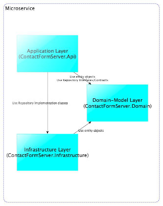
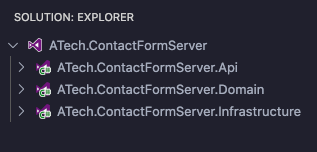

# ATech.ContactFormServer

A .NET Core WebApi to use on static sites with contact form

If you have a static web site hosted on services like [GitHub Pages](https://pages.github.com/) or [GitLab Pages](https://docs.gitlab.com/ee/user/project/pages/), there are many chances that you would like to use a contact form to have some feedback from your site's guests or just to get in touch with them.
There are many options to accomplish the same result, many of them paid, some with a free but feature-limited plan, and others that need a little bit of effort to integrate with your contact form.

Even if the project is very simple, we'll follow of the rules of Domain-Driven Design (DDD) Microservices following Microsoft's guidelines on the subject [Design a DDD-oriented microservice](https://docs.microsoft.com/it-it/dotnet/architecture/microservices/microservice-ddd-cqrs-patterns/ddd-oriented-microservice).

## Solution structure

The solution is made of three layers,



each one implemented as a .NET Core project.



### Application layer

The **application layer** is implemented as a .NET Core 3.1 Web API. The main responsibilities of this module are:

- ASP.NET Web API;
- Network access to microservice;
- API contract/implementation;
- Commands and command handlers;

### Domain layer

The **domain layer** is a .NET Core dll responsible for the implementation of the DDD patterns:

- holding the domain model (a set of *POCO* classes);
- declaring the **Repository Pattern** contracts/interfaces for the aforementioned POCO classes;
- introducing some data validation for the models;
 
#### Domain Entities/Aggregates

As said in the introduction, this is a very simple project requiring only two entities his folder/namespace to implement the business logic of the application:

1. `Account` is the owner entity of the messages;
2. `Message` is the model of a single message;

#### Repository interfaces

This folder/namespace contains all the interfaces/contracts needed to implement a [Repository Pattern](https://docs.microsoft.com/it-it/dotnet/architecture/microservices/microservice-ddd-cqrs-patterns/infrastructure-persistence-layer-design) that will be the intermediary between the domain model layers and data mapping.

### Infrastructure layer

This project contains:

- the implementation of the business logic of the backend;
- the implementation of the interfaces of the [Repository Pattern](https://docs.microsoft.com/it-it/dotnet/architecture/microservices/microservice-ddd-cqrs-patterns/infrastructure-persistence-layer-design) exposed by the domain project;
- the data persistence layer;

#### Entity Framework Core

The OR/M of choice for this project is [Entity Framework Core](https://docs.microsoft.com/it-it/ef/core/), and the approach in the early stages of development of the project is [Code First](https://docs.microsoft.com/it-it/aspnet/core/data/ef-mvc/intro?view=aspnetcore-3.1) but it may change if needed.

Using EF Core CLI, the creation of the database can be done using the following commands

```cmd
maurizioattanasi$ dotnet ef migrations add initial --startup-project ../ATech.ContactFormServer.Api
```

```cmd
maurizioattanasi$ dotnet ef database update --startup-project ../ATech.ContactFormServer.Api
```

## Toolbox

The project itself, as said before, is very simple, and its implementation is only one of the possible flavors of the Domain-Driven Design microservices. A few words more on the tools used in the project to obtain the basic functionalities needed in a production-grade application.

- [Serilog](https://serilog.net): Diagnostic logging of the application is handled by this package that has many powerful options to accomplish this feature;
- [MediatR](https://github.com/jbogard/MediatR): Is used to implement the **Mediator Pattern** in the application controller and a very enlighting article on the matter is [Fat Controller CQRS Diet: Simple Command](https://codeopinion.com/fat-controller-cqrs-diet-simple-command/) written by Derek Comartin;
- [SQLite](https://www.sqlite.org/index.html): Data persistence (for demo purpose only!) is delegated to the famous SQL file database engine;

## CI/CD

A CI/CD workflow is implemented with [GitHub Actions](https://github.com/features/actions) that will deploy the application on [Microsoft Azure](https://azure.microsoft.com/it-it/).

```yaml
# Docs for the Azure Web Apps Deploy action: https://github.com/Azure/webapps-deploy
# More GitHub Actions for Azure: https://github.com/Azure/actions

name: Build and deploy ASP.Net Core app to Azure Web App - atechcontactformserver

on:
 push:
 branches:
 - master

jobs:
 build-and-deploy:
 runs-on: ubuntu-latest

 steps:
 - uses: actions/checkout@master

 - name: Set up .NET Core
 uses: actions/setup-dotnet@v1
 with:
 dotnet-version: '3.1.102'

 - name: Build with dotnet
 run: dotnet build --configuration Release

 - name: dotnet publish
 run: dotnet publish -c Release -o ${{env.DOTNET_ROOT}}/myapp

 - name: Deploy to Azure Web App
 uses: azure/webapps-deploy@v2
 with:
 app-name: 'atechcontactformserver'
 slot-name: 'production'
 publish-profile: ${{ secrets.AzureAppService_PublishProfile_3a651e8c1e9a42a5bd1996554646a4bc }}
 package: ${{env.DOTNET_ROOT}}/myapp
```

